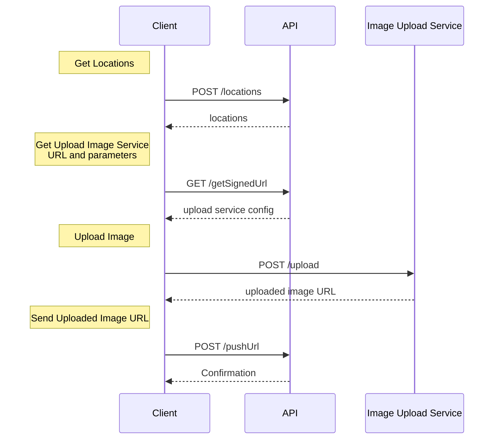

# Rippler

> A Python interface to the [Ripples drink printer platform](https://www.drinkripples.com). It reproduces the flow of the Ripples Web app, allowing for images to be sent to a machine programmatically.

## Features

* Get location of drink printers around a latitude/longitude
* Send an image (either a file, file-like object or public URL) to a machine's custom images queue

## Usage

```bash
pip install rippler
```

See [examples/](./examples) & [docs/](./docs)

## API flow

Typical API flow as used by the Web app.



