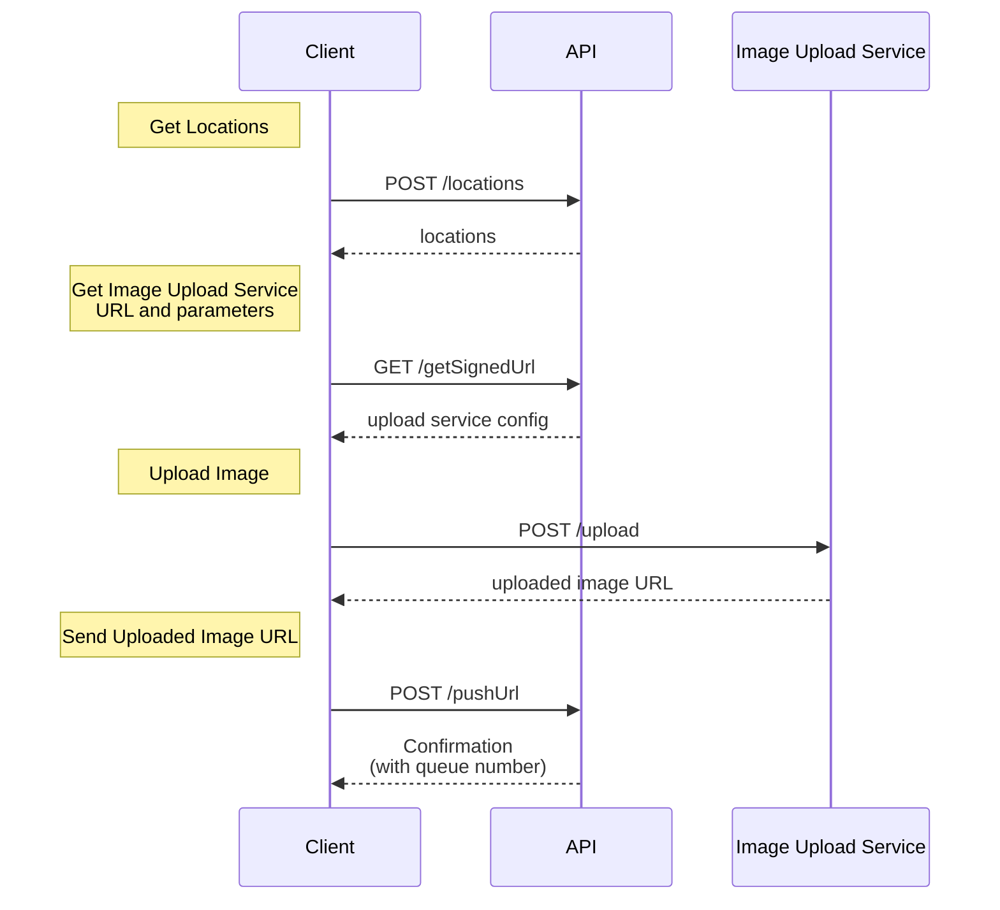

## API flow

Typical API flow as used by the WebApp.

```mermaid
sequenceDiagram
    participant Client
    participant API
    participant Image Upload Service
		
		%% Locations flow
		Note left of Client: Get Locations
		Client->>API: POST /locations
		API-->>Client: locations
		
		%% Upload image flow
		Note left of Client: Get Image Upload Service<br/>URL and parameters
		Client->>API: GET /getSignedUrl
		API-->>Client: upload service config
		
		Note left of Client: Upload Image
		Client->>Image Upload Service: POST /upload
		Image Upload Service-->>Client: uploaded image URL
		
		Note left of Client: Send Uploaded Image URL
		Client->>API: POST /pushUrl
		API-->>Client: Confirmation<br/>(with queue number)
```